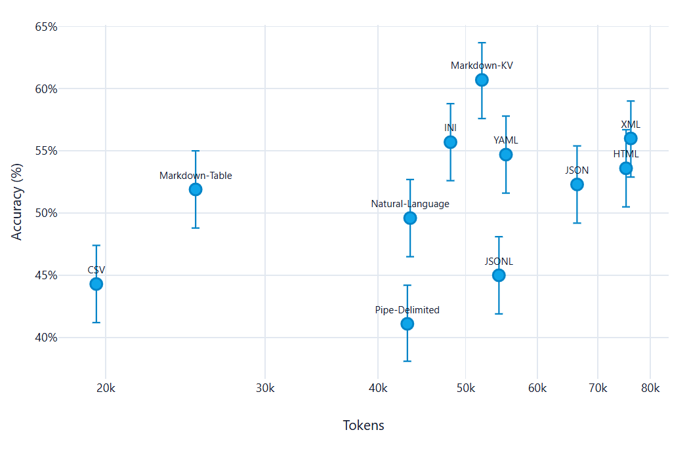
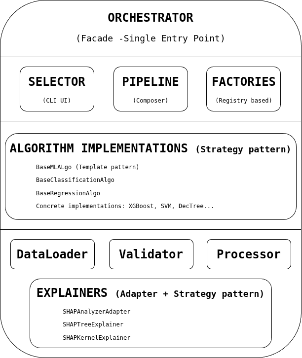
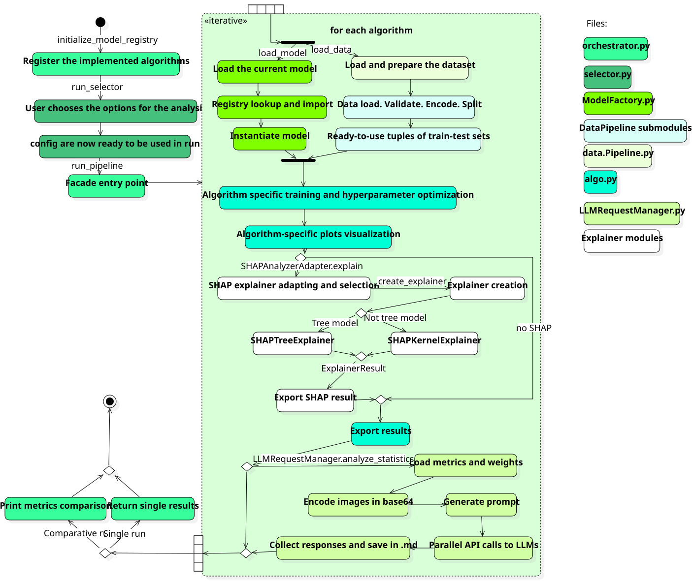

# Explainable Machine Learning Through Large Language Models: Analysis and Prompt Design

<p align="center">
  
  &nbsp;&nbsp;&nbsp;&nbsp;&nbsp;&nbsp;&nbsp;&nbsp;&nbsp;&nbsp;&nbsp;&nbsp;&nbsp;&nbsp;&nbsp;&nbsp;&nbsp;&nbsp;&nbsp;&nbsp;&nbsp;&nbsp;&nbsp;&nbsp;&nbsp;&nbsp;&nbsp;&nbsp;&nbsp;&nbsp;&nbsp;&nbsp;&nbsp;&nbsp;&nbsp;&nbsp;
  
</p>

This repository contains the source files and compiled document of the Bachelor's Thesis in Computer Science by **Lorenzo Soligo** at the **University of Padua**, developed during an internship at **Zucchetti S.p.A.**

---

## Read the Thesis
* **[Read the Thesis (PDF)](./thesis.pdf)** — Open the compiled, ready-to-read PDF version of the thesis.
* **[Main Entrypoint (Typst)](./thesis.typ)** — The root Typst file that imports the configuration and chapters.
* **[Document Structure](./structure.typ)** — The file defining the chapter inclusion order.

---

## Use the product

To use the ML analysis pipeline, go see [XAI ANALYSIS PIPELINE](https://github.com/Solgio/ML-Algorithm-Interpretability/)

---

## Metadata
* **Author:** Lorenzo Soligo (Matricola: 2101057)
* **Degree:** Bachelor's Degree in Computer Science
* **University:** University of Padua
* **Department:** Department of Mathematics "Tullio Levi-Civita"
* **Academic Advisor (Relatore):** Prof. Michele Scquizzato
* **Company Partner:** Zucchetti S.p.A.
* **Company Tutor:** Diego Polesel
* **Academic Year:** 2025-2026
* **Location & Date:** Padua, June 2026

---

## Abstract
As Machine Learning (ML) models become increasingly prevalent in business applications, ensuring their transparency and reliability through Explainable AI (XAI) is critical. This project investigates the interpretability of various machine learning algorithms.

The research systematically evaluates a spectrum of predictive models, ranging from fundamental regression and classification models—such as Linear Regression, Logistic Regression, Support Vector Machines, and Decision Trees—to complex ensemble methods, including Random Forest, XGBoost and Symbolic Regression. The analysis explores both intrinsic model transparency and post-hoc explainability techniques, utilizing metrics like SHAP (SHapley Additive exPlanations) to interpret predictions and feature importance. Furthermore, the methodology encompasses the examination of mathematical foundations, internal knowledge representations, and the impact of ensemble techniques on both model performance and explainability. Real-world validation is performed using datasets such as Student Salary Prediction.

A primary objective of this work is bridging the gap between technical accuracy and human-understandable explanations for non-expert stakeholders. To achieve this, the project leverages advanced Prompt Engineering principles. Tailored prompts for Large Language Models (LLMs) are developed for each analyzed algorithm. These prompts are explicitly designed to automatically generate human-readable explanations of algorithmic behaviors and predictions. Ultimately, the project delivers production-ready implementations and LLM integration adapters, demonstrating how the synthesis of traditional XAI methodologies with modern language models can significantly enhance the transparency, trust, and responsible deployment of AI systems.

---

## Chapter-by-Chapter Overview

You can directly browse the source files of each chapter by clicking on the links below:

### 1. [Chapter 1: Introduction](./chapters/introduction.typ)
* **Topics:** Overview of the Zucchetti S.p.A. internship context, the 8-week stage timeline, project goals classification (necessary, desirable, optional), and the overall thesis outline.

### 2. [Chapter 2: Background Knowledge](./chapters/background.typ)
* **Topics:** Core principles of Explainable AI (XAI) and Prompt Engineering.
  * **[Explainability](./chapters/b-explainability.typ):** Details the dimensions of explainability (Intrinsic Transparency, Global, Modular, and Local Interpretability), contrastive explanations, cause selection, and feature support. Introduces [SHAP analysis](./images/shap-logo.webp) derived from cooperative game theory.
  * **[Prompt Engineering](./chapters/b-prompt-engineering.typ):** Investigates techniques to steer LLMs, including *Expert Personas*, *Familiar Formats* (comparing Markdown, YAML, CSV token efficiency and accuracy), *Chain-of-Thought (CoT)* reasoning, *Zero-Shot* prompting, and *Multimodal* prompt integration.
  <p align="center">
    
  </p>

### 3. [Chapter 3: ML Algorithms Analysis](./chapters/ml-algorithms.typ)
* **Topics:** Mathematical foundations, performance metrics (classification and regression), and interpretability evaluations of the models:
  * **[Linear Regression](./chapters/algo/LR.typ)** (High Intrinsic Transparency; feature coefficients)
  * **[Logistic Regression](./chapters/algo/LogR.typ)** (High Intrinsic Transparency; odds ratio, confusion matrix, ROC/AUC)
  * **[Support Vector Machines (SVM)](./chapters/algo/SVM.typ)** (Low Intrinsic Transparency; hyperplane geometry, post-hoc SHAP required)
  * **[Decision Tree](./chapters/algo/DecisionTree.typ)** (High Intrinsic Transparency; node splits, decision paths)
  * **[Random Forest](./chapters/algo/RandomForest.typ)** (Low Intrinsic Transparency; ensemble trees, SHAP global/local analysis)
  * **[XGBoost](./chapters/algo/XGBoost.typ)** (Low Intrinsic Transparency; gradient boosting, extreme performance, SHAP tree explainer)
  * **[Symbolic Regression](./chapters/algo/SymbR.typ)** (Medium/High Intrinsic Transparency; closed-form mathematical equations)
  * **[Algorithmic Comparison](./chapters/algo/confront.typ)** (A comparative study of predictive power vs. interpretability)

### 4. [Chapter 4: Design and Code Implementation](./chapters/code-implementation.typ)
* **Topics:** Details the architecture and implementation of the Python-based data analysis and LLM explanation pipeline.
* **Architecture:** Layered and modular design obeying SOLID principles and utilizing several design patterns:
  * **Strategy Pattern:** Decoupling specific ML algorithm training and analysis logic.
  * **Template Method Pattern:** Enforcing standard dataset loading, preprocessing, training, evaluation, and explanation sequences.
  * **Factory Pattern:** Dynamically creating machine learning estimators.
  * **Registry Pattern:** Maintaining a clean directory of supported algorithms.
  * **Adapter Pattern:** Adapting various model types to the SHAP explainer format.
  * **Facade Pattern:** Providing a single high-level `run_pipeline()` gateway on the `Orchestrator`.
* **Technologies:** Python, Pandas, Numpy, Scikit-learn, XGBoost, SHAP, Optuna (hyperparameter tuning), and Streamlit (GUI interface).

<p align="center">
  
</p>

* **System Flow Diagram:** Represents the sequential execution of the orchestrator, data pipelines, modeling, and LLM request generation:
<p align="center">
  
</p>

### 5. [Chapter 5: Prompt Engineering](./chapters/prompt.typ)
* **Topics:** The practical prompt architecture designed to translate machine learning outputs into business explanations.
  * **Prompt Layout:** Incorporates system guidelines, algorithm-specific contexts, user expectations, numerical metrics, coefficients, and multimodal assets.
  * **Strict Explainability Rules:** Guidelines supplied to the LLM (e.g., limit explanations to 3-5 key features, contrastive reasoning, warning users of low-support outliers, avoiding mathematical formulas).
  * **Multimodal Visual Inputs:** Base64-encoding graphs (e.g., residuals plots, SHAP summary plots) to help the vision-language model identify model assumptions and distribution anomalies.

### 6. [Chapter 6: Conclusion](./chapters/conclusion.typ)
* **Topics:** Validation of the project outcomes:
  * **Goals Evaluation:** Status analysis of academic and industrial targets.
  * **Requirements Traceability Matrix:** Mapping functional and non-functional requirements to code components.
  * **Limitations:** Analyzing the challenge of visual plot descriptions and model consistency issues.
  * **Future Work:** Efficiency optimizations and expanding the pipeline to unsupervised/semi-supervised ML techniques.

---

## 🛠️ How to Compile the Thesis
This project uses **[Typst](https://typst.app/)**, a modern, fast, and open-source markup language for typesetting documents.

### Prerequisites
Install the Typst compiler. For example:
* **Arch Linux:** `sudo pacman -S typst`
* **macOS:** `brew install typst`
* **Windows (via winget):** `winget install Typst.Typst`
* Alternatively, use the [Typst Online Editor](https://typst.app/).

### Commands
All commands should be executed from the root directory of this repository.

* **Compile the PDF:**
  ```bash
  typst compile thesis.typ
  ```

* **Compile with PDF/A-3b compliance (standard for university archives):**
  ```bash
  typst compile thesis.typ --pdf-standard a-3b
  ```

* **Live Watch mode (automatically recompiles the PDF on save):**
  ```bash
  typst watch thesis.typ
  ```

---

## Appendix Reference
* **[Glossary Terms](./appendix/glossarium/terms.typ)** — Source list of definitions (Explainable AI, SHAP, etc.).
* **[Bibliography](./appendix/bibliography/bibliography.typ)** — Thesis academic citations.
